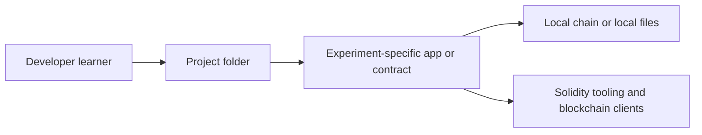
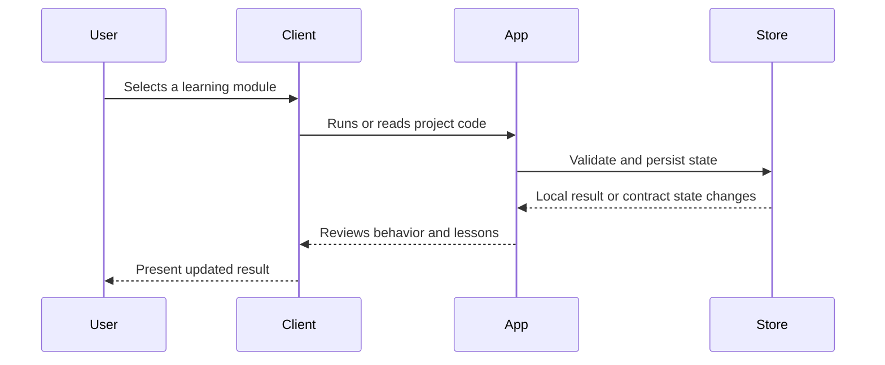

# Architecture

The repository is a multi-project lab. Each folder should be evaluated independently, with shared documentation serving as a map across concepts.

## Component View

## Key Components

- Solidity basics
- Auction and token experiments
- Chat and decentralized game examples
- HashItOut project folder

## Main Workflow

## Design Considerations

- Keep each experiment independently understandable
- Document expected tool versions per folder
- Promote historical context over production claims

